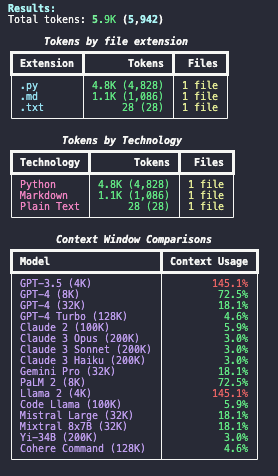

# Code Token Counter

A tool for analyzing codebases to understand their token usage and compatibility with various Large Language Models (LLMs). This tool helps developers understand if their code can fit within different LLM context windows and how it's distributed across different technologies.

## Features

- **Local & Remote Analysis**: Analyze both local directories and remote Git repositories
- **Smart File Detection**: Automatically detects and processes text-based files while ignoring binaries
- **Technology Categorization**: Groups files by their technology/language (Python, JavaScript, Markdown, etc.)
- **Comprehensive LLM Comparisons**: Compares token counts against popular LLM context windows:
  - OpenAI Models (GPT-3.5, GPT-4, GPT-4 Turbo)
  - Anthropic Models (Claude 2, Claude 3 variants)
  - Google Models (Gemini Pro, PaLM 2)
  - Meta Models (Llama 2, Code Llama)
  - Other Models (Mistral, Mixtral, Yi, Cohere)
- **Intelligent Directory Exclusion**: Automatically excludes common non-source directories (venv, .git, **pycache**, etc.)

## Installation

You can install and run this tool using either traditional pip or the modern uv package manager.

### Using uv (Recommended)

The script includes inline dependencies, so you can run it directly with uv:

```bash
# Install uv if you haven't already
curl -LsSf https://astral.sh/uv/install.sh | sh

# Run the script directly (no virtual environment needed)
uv run token_counter.py <path_or_repo>
```

### Using pip

```bash
# Create and activate a virtual environment (recommended)
python -m venv venv
source venv/bin/activate  # On Windows: .\venv\Scripts\activate

# Install dependencies
pip install -r requirements.txt
```

## Usage

You can use the script to analyze both local directories and remote Git repositories:

```bash
# Using uv (recommended)
uv run token_counter.py https://github.com/username/repo
uv run token_counter.py .

# Using traditional python
python token_counter.py https://github.com/username/repo
python token_counter.py .
```

## Output Format

The tool provides a detailed breakdown of token usage:

1. **Total Token Count**: Overall tokens in the codebase
2. **File Extension Breakdown**: Tokens and file count per extension
3. **Technology Distribution**: Tokens and file count grouped by programming language/technology
4. **Context Window Analysis**: Percentage of various LLM context windows used

Example output (text only):

```text
Results:
Total tokens: 5.9K (5,942)

      Tokens by file extension
┏━━━━━━━━━━━┳━━━━━━━━━━━━━━┳━━━━━━━━┓
┃ Extension ┃       Tokens ┃  Files ┃
┡━━━━━━━━━━━╇━━━━━━━━━━━━━━╇━━━━━━━━┩
│ .py       │ 4.8K (4,828) │ 1 file │
│ .md       │ 1.1K (1,086) │ 1 file │
│ .txt      │      28 (28) │ 1 file │
└───────────┴──────────────┴────────┘

         Tokens by Technology
┏━━━━━━━━━━━━┳━━━━━━━━━━━━━━┳━━━━━━━━┓
┃ Technology ┃       Tokens ┃  Files ┃
┡━━━━━━━━━━━━╇━━━━━━━━━━━━━━╇━━━━━━━━┩
│ Python     │ 4.8K (4,828) │ 1 file │
│ Markdown   │ 1.1K (1,086) │ 1 file │
│ Plain Text │      28 (28) │ 1 file │
└────────────┴──────────────┴────────┘

        Context Window Comparisons
┏━━━━━━━━━━━━━━━━━━━━━━━━┳━━━━━━━━━━━━━━━┓
┃ Model                  ┃ Context Usage ┃
┡━━━━━━━━━━━━━━━━━━━━━━━━╇━━━━━━━━━━━━━━━┩
│ GPT-3.5 (4K)           │        145.1% │
│ GPT-4 (8K)             │         72.5% │
│ GPT-4 (32K)            │         18.1% │
│ GPT-4 Turbo (128K)     │          4.6% │
│ Claude 2 (100K)        │          5.9% │
│ Claude 3 Opus (200K)   │          3.0% │
│ Claude 3 Sonnet (200K) │          3.0% │
│ Claude 3 Haiku (200K)  │          3.0% │
│ Gemini Pro (32K)       │         18.1% │
│ PaLM 2 (8K)            │         72.5% │
│ Llama 2 (4K)           │        145.1% │
│ Code Llama (100K)      │          5.9% │
│ Mistral Large (32K)    │         18.1% │
│ Mixtral 8x7B (32K)     │         18.1% │
│ Yi-34B (200K)          │          3.0% │
│ Cohere Command (128K)  │          4.6% │
└────────────────────────┴───────────────┘
```

Example output (image w/ colors):



## Supported File Types

The tool supports a wide range of file types including:

- Programming Languages (Python, JavaScript, TypeScript, Java, C/C++, etc.)
- Web Technologies (HTML, CSS, SCSS, Vue, React, etc.)
- Documentation (Markdown, reStructuredText)
- Configuration (YAML, TOML, JSON)
- And many more

## Contributing

Contributions are welcome! Feel free to open issues or submit pull requests for:

- Adding support for new file types
- Including new LLM context windows
- Improving token counting accuracy
- Enhancing performance for large codebases

## License

MIT License - Feel free to use and modify as needed.
